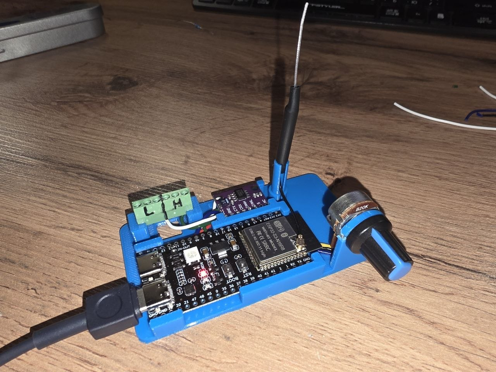
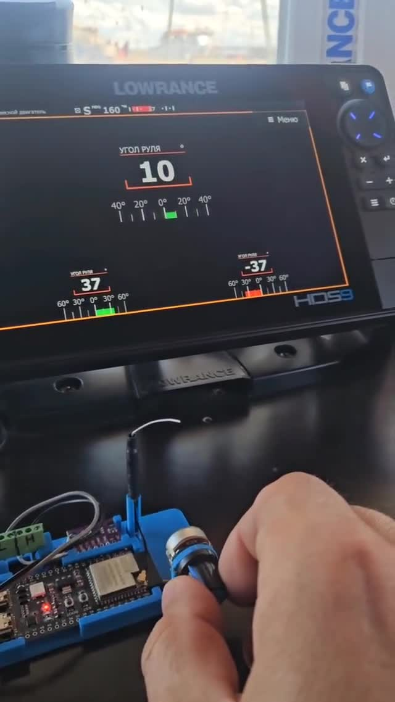

# ESP32-S3 NMEA2000 Rudder Simulator

An NMEA2000 steering control simulator for **ESP32-S3 DevKitC-1** that reads rudder position from a potentiometer and broadcasts **PGN 127245 (Rudder)** over the CAN bus.


## Overview

This firmware emulates a steering control device (Steering Control, Class 75, Function 160) on an NMEA2000 network. It reads an analog voltage from a potentiometer (ADC, 12-bit), converts it to a rudder angle, and transmits the value every 200 ms as PGN 127245.

Useful for testing NMEA2000-compatible instruments such as chartplotters, autopilots, and MFDs without a real rudder sensor.



## Hardware Pinout

| Component       | GPIO  | Purpose                               |
|-----------------|-------|---------------------------------------|
| POT (knob)      | 4     | Analog input (ADC, 12-bit)            |
| CAN TX          | 17    | CAN bus transmit (TWAI)               |
| CAN RX          | 16    | CAN bus receive (TWAI)                |

> **Note:** A CAN transceiver (e.g., SN65HVD230, MCP2551) is required between the ESP32-S3 TWAI pins and the NMEA2000 bus.

## How It Works

1. **Read**: The ADC reads the potentiometer voltage (raw value 0–4095).
2. **Map**: The raw ADC value is linearly mapped to a rudder angle:
   - `0` → `−40°` (full port)
   - `2047` → `0°` (amidships)
   - `4095` → `+40°` (full starboard)
3. **Transmit**: Every **200 ms** a PGN 127245 (Rudder) message is sent with the current angle in radians.
4. **Diagnostics** (optional): Serial output at 115200 baud shows the raw ADC value, calculated angle, and the raw CAN frame in hex.

### Demo

[](https://www.youtube.com/shorts/nCSdF_QO_ZA)

## Technical Details

- **MCU**: ESP32-S3 (ESP32-S3-DevKitC-1)
- **Framework**: Arduino (via PlatformIO)
- **CAN**: TWAI (Two-Wire Automotive Interface), compatible with the NMEA2000 physical layer
- **NMEA2000 Mode**: NodeOnly (source address 22, single-node)
- **Transmit PGNs**: 126996 (Product Information), 126998 (Configuration Information), 127245 (Rudder)
- **Transmit Period**: 200 ms
- **Serial Monitor**: 115200 baud (diagnostics optional via `#define ENABLE_SERIAL_OUTPUT`)

## Dependencies (PlatformIO)

| Library                                                      | Version / Ref          |
|--------------------------------------------------------------|------------------------|
| `ttlappalainen/NMEA2000-library`                             | `^4.22.0`              |
| `offspring/NMEA2000_esp32` (GitHub)                          | `main` (ESP32-S3 support) |
| `sparkfun/SparkFun BME280`                                   | `^2.0.9`               |

Dependencies are resolved automatically by PlatformIO during the first build.

## Getting Started

### Prerequisites

- [Visual Studio Code](https://code.visualstudio.com/) with the [PlatformIO IDE](https://platformio.org/install/ide?install=vscode) extension
- An ESP32-S3 DevKitC-1 board
- A CAN transceiver module and NMEA2000 cable (for on-bus testing)

### Build & Flash

```bash
# Clone the repository
git clone https://github.com/boatdev/can-rudder-simulator.git
cd can-rudder-simulator

# Compile
pio run

# Upload to the board
pio run --target upload

# Monitor serial output (115200 baud)
pio device monitor --baud 115200
```

### Serial Diagnostics

With `#define ENABLE_SERIAL_OUTPUT` enabled (default), you will see output like:

```
0002AFF5 0FF00 0FA0000000000000  [2047: 0.0°]
0002AFF5 0FF00 0FA0000000000000  [3072: 20.0°]
```

The line format is:
```
CAN_ID(8 hex) flags(5 hex) payload(16 hex)  [ADC_raw: angle_deg°]
```

## Configuration

Edit `src/ESP32S3_NMEA2000_device_simulator.ino` to adjust:

| Setting                      | Location                                              |
|------------------------------|-------------------------------------------------------|
| NMEA2000 source address      | `NMEA2000.SetMode(tNMEA2000::N2km_NodeOnly, 22)`    |
| Transmit period              | `tN2kSyncScheduler RudderScheduler(false, 200, 0)`   |
| Angle range                  | `map(pot, 0, 4095, -40, 40)`                         |
| CAN TX/RX pins               | `ESP32_CAN_TX_PIN` / `ESP32_CAN_RX_PIN`              |
| Enable/disable serial output | `#define ENABLE_SERIAL_OUTPUT`                        |

## File Structure

```
.
├── LICENSE                     # MIT License
├── README.md                   # This file
├── images/
│   ├── photo.jpg               # Device photo
│   └── demo.mp4                # Demo video
├── platformio.ini              # PlatformIO configuration
├── .gitignore                  # Files ignored by git
└── src/
    └── ESP32S3_NMEA2000_device_simulator.ino  # Main firmware
```

## License

MIT — see [LICENSE](LICENSE).

## Acknowledgments

- Original concept by [skpang](https://github.com/skpang/ESP32S3_NMEA2000_device_simulator)
- [NMEA2000-library](https://github.com/ttlappalainen/NMEA2000-library) by ttlappalainen
- [NMEA2000_esp32](https://github.com/offspring/NMEA2000_esp32) by offspring